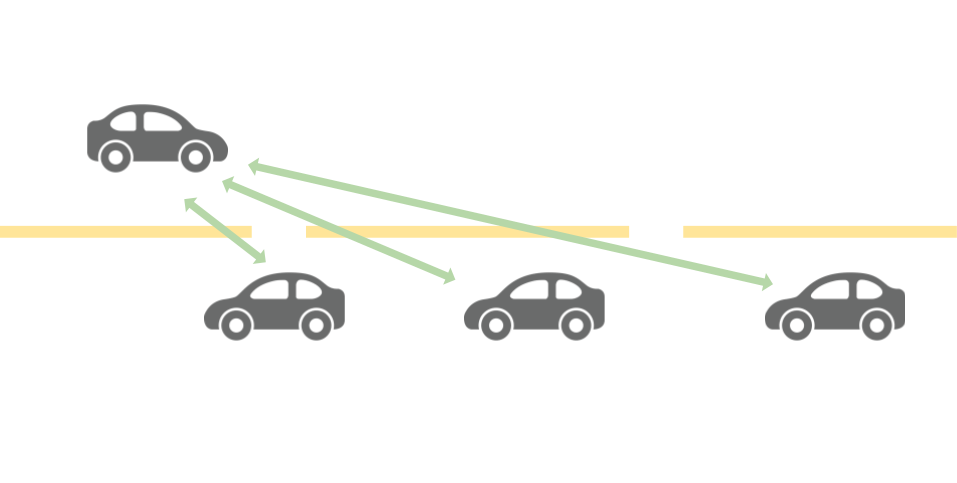
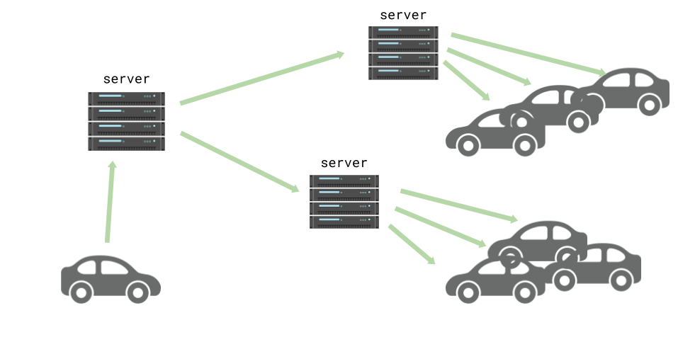

# Systems

Below are two options for implementing a route planning system, one of which doesn't match our constraints.

## Vehicle &rarr; vehicles (accepted)

The idea behind a vehicle to vehicles system is that as vehicles pass each other on the road, they will send each other messages about what they know.

### Constraints

Let's look at how this system meets our constraints:

#### Open
_The system must be open so that it benefits everyone fairly and will continue to do so as it evolves._

As the system is fundamentally peer to peer by design, people will be able to install and run software systems they can inspect or build themselves. This makes the system a protocol over an implementation, which allows for a lot of freedom and improvements. There's also a clear path for evolution because people can upgrade the protocol to a new version.

#### Robust
_The system must be resilient to [malicious actors](https://www.wired.com/story/99-phones-fake-google-maps-traffic-jam/)_

Because the technology will only be able to accept data from physically nearby objects, it drastically reduces the ability of a malicious actor to trick the system. It may be possible to use the [Doppler effect](https://en.wikipedia.org/wiki/Doppler_effect) to ensure that the information you're receiving is coming from a vehicle you can "see". As you're receiving the information from another vehicle, it's likely they have a vested interest in a working system and are less likely to intentionally spread misinformation. It's also much more expensive to spread misinformation this way, as you will have to purchase many vehicles and pay for their fuel. Although it seriously undermines the type of privacy we would hope to build into the system, it would be trivial to identify the source of the information by their number plate and simply discard information from known bad actors. This won't be built into the first version for privacy reasons, but it seems almost impossible to stop others adding this capability. One saving grace is that in the future it's very unlikely people will own their vehicles, so knowing where a given vehicle has been won't be much of a privacy invasion.

#### Distributed

_The system must not centralise trust in a single organisation or entity._

There is nothing but the vehicles and their onboard computers in this system making it _completely_ distributed. The only way it could become centralised is if someone offered enhancements by providing a service that allowed you to send all the information you'd gathered to a server and it would provide you with faster or better insights in return. This may or may not be a desirable thing depending very much on how it unfolds.

#### Powerful
_The system must provide compelling advantages over a closed or centralised system, so people are incentivised to adopt it._

The system will freely provide its users with up-to-the-minute information on local road conditions. Furthermore it will be paired with a system that can make use of those insights and provide the vehicle with near real time optimal routing information. Because the logical processing of information is localised to the vehicle, it is only incentivised to look out for its own interests. Whilst this may sound selfish and undesirable, it's more likely it will lead to optimal solution for everyone while being "naturally fair". Society may choose to adopt a more complex system that gives way to vehicles like ambulances, leading to possible abuses. Ideally congestion will be a thing of the past and optimising for emergency services won't be necessary.

## Vehicle &rarr; server &rarr; vehicles (rejected)

**Rejection reason:** it's not clear how it's possible to provide acceptable levels of privacy, make it easy to use and adopt, and also protect against malicious actors sending fake traffic information to the server. An example of this in action can be seen in [this story about a man towing a cart of mobile phones to fool google maps](https://www.wired.com/story/99-phones-fake-google-maps-traffic-jam/).

In this system, vehicles would post the relevant information[^1] to a server, or multiple servers, and then be able to subscribe to an information feed from those servers.

As it's nearly impossible to stop someone posting false information, this system isn't sufficiently robust to meet our constraints. There are other problems, such as centralisation creep[^2] and having an open feed of all information making it trivial to undo privacy protections using statistical methods.

[^1]: Whilst the "relevant information" is left implicit in this section, you can imagine it's something like the vehicle's current position and velocity (speed and direction). Future sections will deal with the specifics.

[^2]: Even if you provide people with a system that's decentralised by design, requiring the general public to look after their own infrastructure will lead to mass adoptoin of centralised services. Bitcoin is one example where most users use exchanges like coinbase, thus undermining one of the key advantages of the system. Centralisation is convenient and the majority of people appear to value convenience over other attributes of a system.
